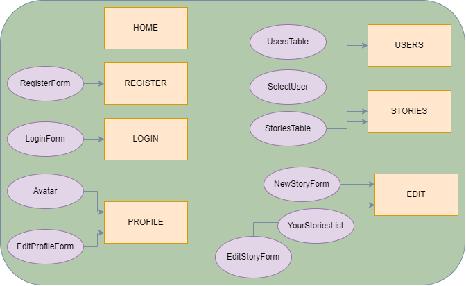

# The Tripper App

This is one of my school projects, a MERN app for posting stories about cycle trips. Some features are public, others require a user account in order to access.

## Table of contents

  - [The Tripper App](#the-tripper-app)
  - [Table of contents](#table-of-contents)
  - [Technologies](#technologies)
  - [Features](#features)  
  - [React Components](#react-components)
  - [API endpoints](#api-endpoints)
  - [Testing](#testing)
  - [Demo](#demo)
  - [Further Improvements](#further-improvements)

## Technologies

- Frontend: React
- Backend: Node Express
- Database: Mongo Atlas

## Features

- Registration
- User Login
- Read stories with user selection (public)
- List all users (public)
- Post a new story (users only)
- Edit posted story (users only)

## React Components

Layout components and pages are directly connected to App.js while the components are connected to the different pages as shown in the image below.

## Testing

Example Users for testing (Anna, Beata, Clara)

- User 1: Anna, annA123
- User 2: Beata, beatA456
- User 3: Clara, clarA789

### API endpoints

API can be tested with Postman. Use **http://86.50.228.217** as the base url, and test the following endpoints:

**GET /api/stories/all** - Get all stories from the DB

**GET /api/stories/user** - Get all stories of one selected user

**POST /api/stories** - Create a new story - **Private Access**

**PATCH /api/stories:storyid** - Edit one existing story - **Private Access**

**DELETE /api/stories:storyid** - Delete one story from the DB

**POST /api/users/signup** - Create new user account

**GET /api/users** - Get all users

**POST /api/users/login** - User Login

**GET /api/users/:id** - Find a User by ID

**PATCH /api/users/:name** - Update User Data - **Private, Under Test**

**POST /api/users/upload** - Upload a user image

**DELETE /api/users/:id** - Delete a user - **Private**

Some API endpoints are tested only with Postman but not yet built in as a UI feature.

## Demo

There is a live version of this app, deployed manually on a ubuntu virual server in the cPouta cloud:

[Link to the live version](http://86.50.228.217/)

## Further Improvements

- Testing exercises with Cypress and Robot Framework
- Building some tests into a Jenkins pipeline
